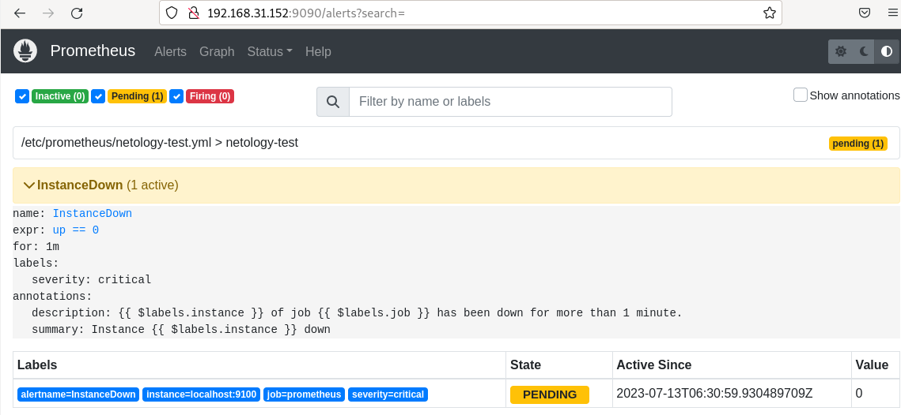
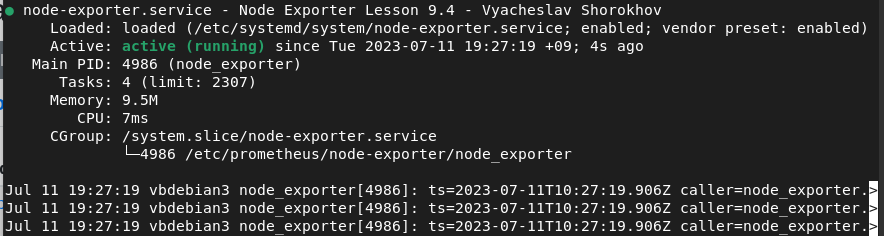
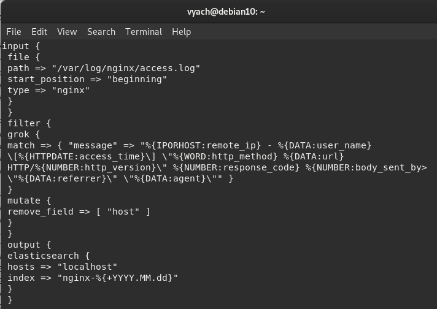
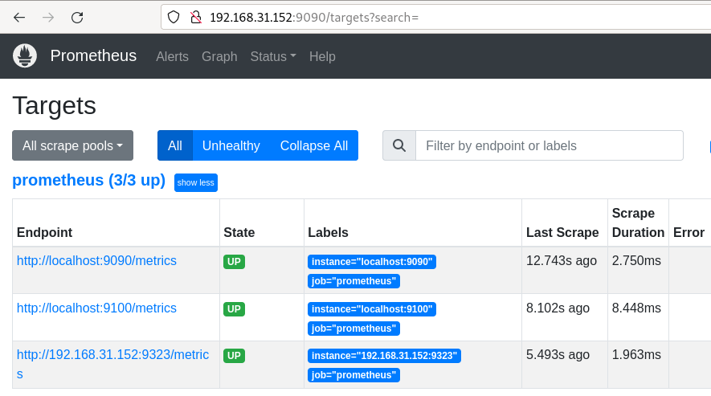
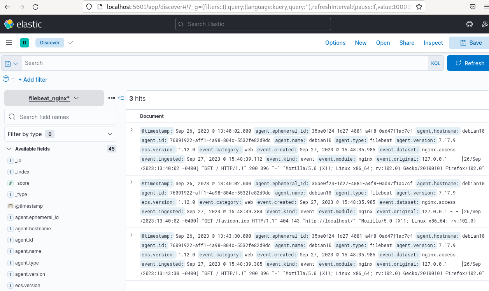
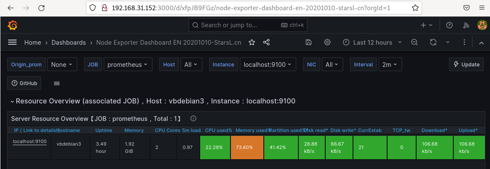

# Домашнее задание к занятию "`Система мониторинга Prometheus`" - `Шорохов Вячеслав`

---

### Задание 1

Установите Prometheus.

Требования к результату:
Прикрепите к файлу README.md скриншот systemctl status prometheus, где будет написано: prometheus.service — Prometheus Service Netology Lesson 9.4 — Ваши ФИО

#### Решение:

`Скриншот systemctl status prometheus:

---

### Задание 2

Установите Node Exporter.

Требования к результату:
Прикрепите к файлу README.md скриншот systemctl status node-exporter, где будет написано: node-exporter.service — Node Exporter Netology Lesson 9.4 — Ваши ФИО

#### Решение:

`Скриншот systemctl status node-exporter:

---

### Задание 3

Подключите Node Exporter к серверу Prometheus.

Требования к результату:
- Прикрепите к файлу README.md скриншот конфигурации из интерфейса Prometheus вкладки Status > Configuration
- Прикрепите к файлу README.md скриншот из интерфейса Prometheus вкладки Status > Targets, чтобы было видно минимум два эндпоинта

#### Решение:

`Скриншот Status > Configuration:

`Скриншот Status > Targets:

---

## Дополнительные задания (со звездочкой*)

### Задание 4

Установите Grafana.

Требования к результату:
Прикрепите к файлу README.md скриншот левого нижнего угла интерфейса, чтобы при наведении на иконку пользователя были видны ваши ФИО

#### Решение:

`Скриншот веб интерфейса:

---

### Задание 5

Интегрируйте Grafana и Prometheus.

Требования к результату:
Прикрепите к файлу README.md скриншот дашборда (ID:11074) с поступающими туда данными из Node Exporter

#### Решение:

`Скриншот дашборда (ID:11074):

---
