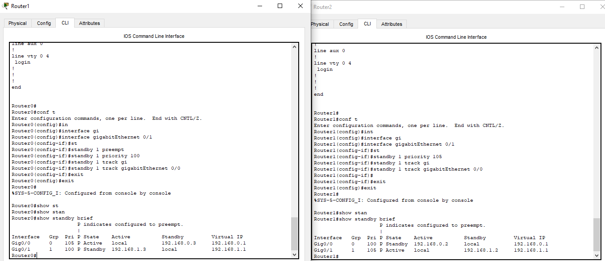
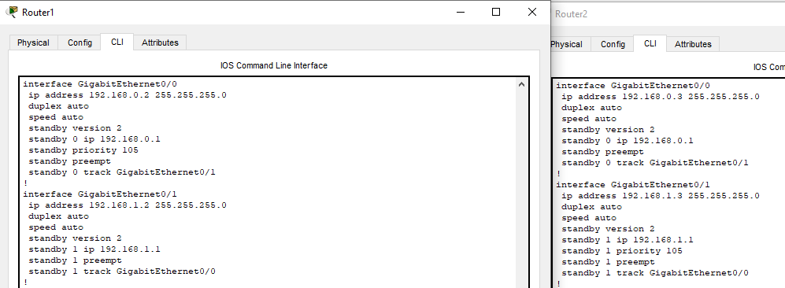

# Домашнее задание к занятию 1 SFLT "` Disaster recovery и Keepalived`" - `Шорохов Вячеслав`

---

### Задание 1

- Дана [схема](https://github.com/netology-code/sflt-homeworks/blob/main/1/hsrp_advanced.pkt) для Cisco Packet Tracer, рассматриваемая в лекции.
- На данной схеме уже настроено отслеживание интерфейсов маршрутизаторов Gi0/1 (для нулевой группы)
- Необходимо аналогично настроить отслеживание состояния интерфейсов Gi0/0 (для первой группы).
- Для проверки корректности настройки, разорвите один из кабелей между одним из маршрутизаторов и Switch0 и запустите ping между PC0 и Server0.
- На проверку отправьте получившуюся схему в формате pkt и скриншот, где виден процесс настройки маршрутизатора.

#### Решение:

Файл pkt:


`Скриншот внесения настроек и вывода команды show standby brief:


`Скриншот вывода команды show running-config:


---

### Задание 2

- Запустите две виртуальные машины Linux, установите и настройте сервис Keepalived как в лекции, используя пример конфигурационного [файла](https://github.com/netology-code/sflt-homeworks/blob/main/1/keepalived-simple.conf).
- Настройте любой веб-сервер (например, nginx или simple python server) на двух виртуальных машинах
- Напишите Bash-скрипт, который будет проверять доступность порта данного веб-сервера и существование файла index.html в root-директории данного веб-сервера.
- Настройте Keepalived так, чтобы он запускал данный скрипт каждые 3 секунды и переносил виртуальный IP на другой сервер, если bash-скрипт завершался с кодом, отличным от нуля (то есть порт веб-сервера был недоступен или отсутствовал index.html). Используйте для этого секцию vrrp_script
- На проверку отправьте получившейся bash-скрипт и конфигурационный файл keepalived, а также скриншот с демонстрацией переезда плавающего ip на другой сервер в случае недоступности порта или файла index.html

#### Решение:

Фаил bash скрипта :


```
#!/bin/bash

nc -w 1 -z 192.168.56.104 80 2>/dev/null && test -f /var/www/html/index.nginx-debian.html
```

Фаил конфигурации keepalived:


```
vrrp_script keepalived_check {
        script "/usr/local/bin/keepalived_check.sh"
        interval 3
}

vrrp_instance VI_1 {
        state MASTER
        interface enp0s8
        virtual_router_id 111
        priority 255
        advert_int 1

        virtual_ipaddress {
              192.168.56.111/24
        }

        track_script {
              keepalived_check
        }

}
```

`Скриншот 1 логов keepalived:


`Скриншот 2 логов keepalived:


---
