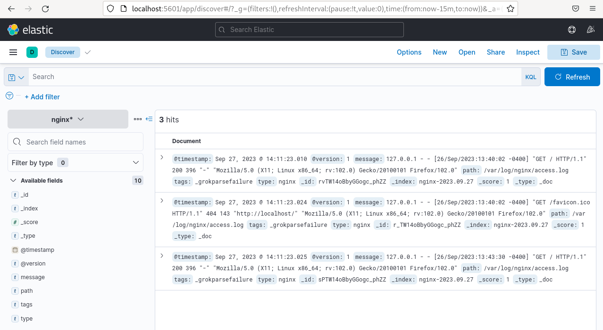
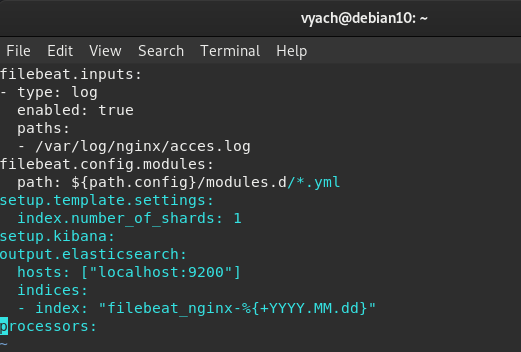
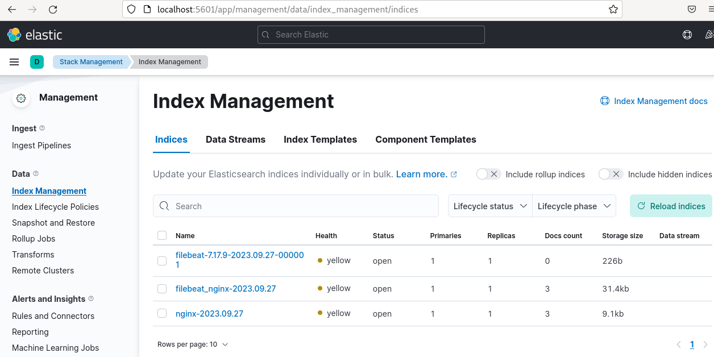

# Домашнее задание к занятию SYSDB-20 "ELK" - `Шорохов Вячеслав`

---

### Задание 1. Elasticsearch

Установите и запустите Elasticsearch, после чего поменяйте параметр cluster_name на случайный.

_Приведите скриншот команды 'curl -X GET 'localhost:9200/_cluster/health?pretty', сделанной на сервере с установленным Elasticsearch. Где будет виден нестандартный cluster_name_.

#### Решение:

`Результат работы команды curl -X GET 'localhost:9200/_cluster/health?pretty:

---

### Задание 2. Kibana

Установите и запустите Kibana.

_Приведите скриншот интерфейса Kibana на странице http://<ip вашего сервера>:5601/app/dev_tools#/console, где будет выполнен запрос GET /_cluster/health?pretty_.

#### Решение:

`Результат работы команды GET /_cluster/health?pretty_:

---

### Задание 3. Logstash

Установите и запустите Logstash и Nginx. С помощью Logstash отправьте access-лог Nginx в Elasticsearch.

_Приведите скриншот интерфейса Kibana, на котором видны логи Nginx._

#### Решение:

`Логи nginx в kibana через logstash:

`Настройка logstash:

---

### Задание 4. Filebeat.

Установите и запустите Filebeat. Переключите поставку логов Nginx с Logstash на Filebeat.

_Приведите скриншот интерфейса Kibana, на котором видны логи Nginx, которые были отправлены через Filebeat._

#### Решение:

`Логи nginx в kibana через filebeat:

`Настройка filebeat:

`Список индексов:

---
