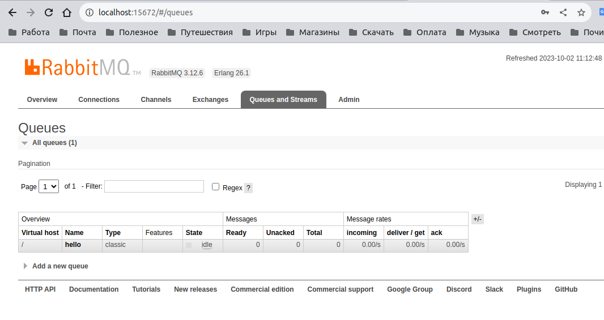

# Домашнее задание к занятию "`# Prometheus. Часть 2`" - `Шорохов Вячеслав`

---

### Задание 1

Создайте файл с правилом оповещения, как в лекции, и добавьте его в конфиг Prometheus.

Требования к результату:
Погасите node exporter, стоящий на мониторинге, и прикрепите скриншот раздела оповещений Prometheus, где оповещение будет в статусе Pending

#### Решение:

`Скриншот раздела оповещений Prometheus:

---

### Задание 2

Установите Alertmanager и интегрируйте его с Prometheus.

Требования к результату:
Прикрепите скриншот Alerts из Prometheus, где правило оповещения будет в статусе Fireing, и скриншот из Alertmanager, где будет видно действующее правило оповещения

#### Решение:

`Скриншот Alerts из Prometheus:

`Скриншот из Alertmanager:

---

### Задание 3

Активируйте экспортёр метрик в Docker и подключите его к Prometheus.

Требования к результату:
приложите скриншот браузера с открытым эндпоинтом, а также скриншот списка таргетов из интерфейса Prometheus.

#### Решение:

`Скриншот браузера с открытым эндпоинтом:

`Скриншот списка таргетов из интерфейса Prometheus:

---

## Дополнительные задания (со звездочкой*)

### Задание 4

Создайте свой дашборд Grafana с различными метриками Docker и сервера, на котором он стоит.

Требования к результату:
Приложите скриншот, на котором будет дашборд Grafana с действующей метрикой

#### Решение:

`Скриншот дашборда Grafana с действующей метрикой:

---
