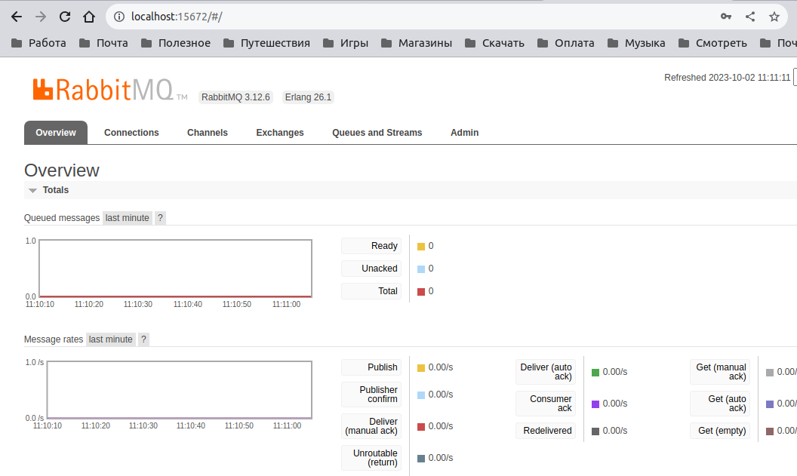
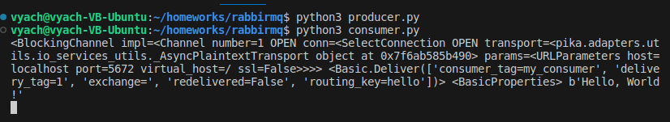

# Домашнее задание к занятию 2 SFLT "Кластеризация и балансировка нагрузки" - `Шорохов Вячеслав`

---

### Задание 1

- Запустите два simple python сервера на своей виртуальной машине на разных портах
- Установите и настройте HAProxy, воспользуйтесь материалами к лекции по [ссылке](https://github.com/netology-code/sflt-homeworks/blob/main/2)
- Настройте балансировку Round-robin на 4 уровне.
- На проверку направьте конфигурационный файл haproxy, скриншоты, где видно перенаправление запросов на разные серверы при обращении к HAProxy.

#### Решение:

Конфигурационный файл haproxy,:


```
listen netology_homework_shorokhovvi
	mode tcp
	bind :1325
 	balance roundrobin
	server s1 127.0.0.1:7777 check
	server s2 127.0.0.1:8888 check
```


`Cкриншот, где видно перенаправление запросов на разные серверы при обращении к HAProxy:


---

### Задание 2

- Запустите три simple python сервера на своей виртуальной машине на разных портах
- Настройте балансировку Weighted Round Robin на 7 уровне, чтобы первый сервер имел вес 2, второй - 3, а третий - 4
- HAproxy должен балансировать только тот http-трафик, который адресован домену example.local
- На проверку направьте конфигурационный файл haproxy, скриншоты, где видно перенаправление запросов на разные серверы при обращении к HAProxy c использованием домена example.local и без него.

#### Решение:

Конфигурационный файл haproxy,:


```
frontend homework_netology_shorokhovvi  # секция фронтенд
        mode http
        bind :8088
	acl ACL_homework hdr(host) -i example.local
	use_backend web_servers if ACL_homework

backend web_servers    # секция бэкенд
        mode http
        balance roundrobin
        option httpchk
        http-check send meth GET uri /index.html
        server s1 127.0.0.1:7777 check inter 3s weight 2
        server s2 127.0.0.1:8888 check inter 3s weight 3
	server s3 127.0.0.1:9999 check inter 3s weight 4
```

`Cкриншот, где видно перенаправление запросов на разные серверы при обращении к HAProxy c использованием домена example.local:


`Скриншот, где видно перенаправление запросов на разные серверы при обращении к HAProxy без использования домена example.local:


---
